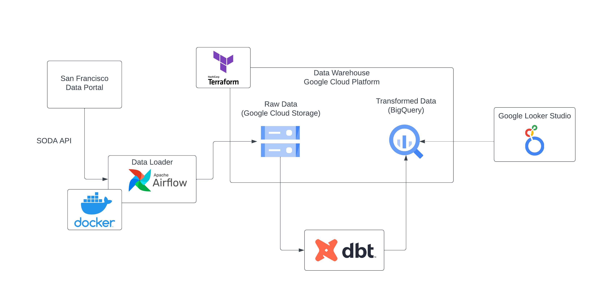
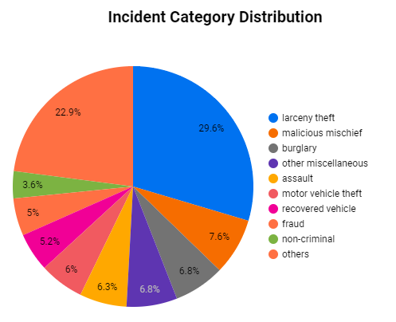
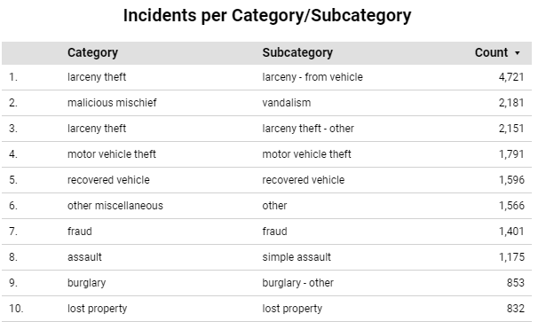
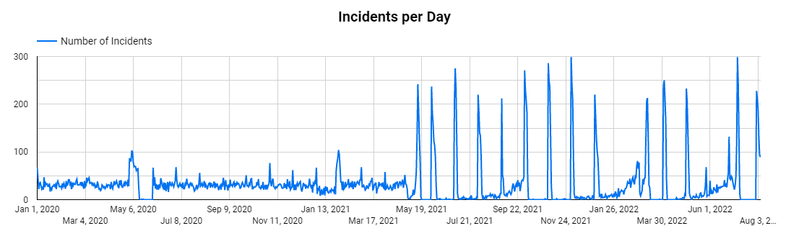
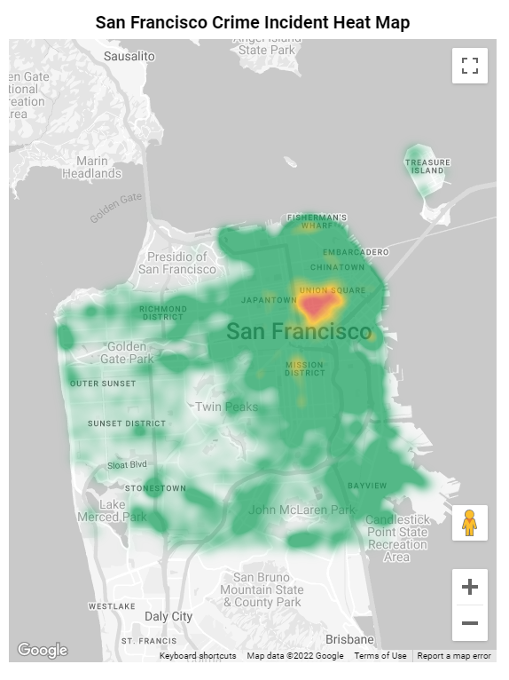

# San Francisco Crime Data Capstone Project

Small example of an data pipeline using San Francisco Police department incident reports.

## Project Architecture

## Required Components

* [Google Cloud Platform](./gcp/)
* [Terraform](./terraform/)
* [Apache Airflow](./airflow/)
* [dbt](./dbt/)

## Visualizations

