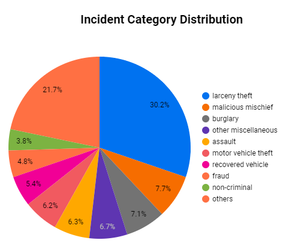
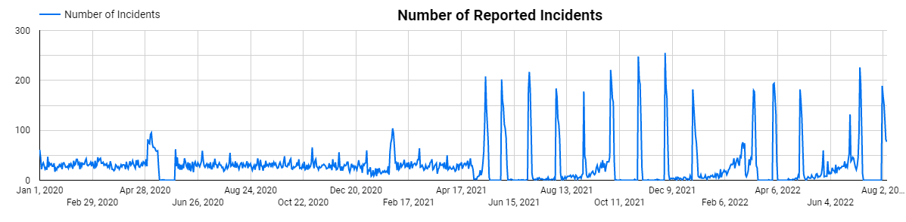

# San Francisco Crime Data Engineering Capstone Project

I'm simply curious about the nature of crime in the city of San Francisco. Let's examine the data of the crime incidents reported from January 1, 2020 to August 1, 2022.

For this analysis, I will use the city of [San Francisco's Open Data Portal](https://datasf.org/opendata/) to grab the incident report data.

## Project Architecture

Below is a pictoral description of the architecture used in this project.

To summarize, the Airflow DAG will extract the data from the San Francisco data portal via Socrata Open Data API and upload parquet files to the data lake. From there data is moved from the lake to warehouse. dbt will transform the data in the warehouse to be used by Google Looker Studio.

## Required Components

The following tools are used in this project:

* [Google Cloud Platform](./gcp/)
* [Terraform](./terraform/)
* [Apache Airflow](./airflow/)
* [dbt](./dbt/)
* [Socrata Open Data Application Programming Interface (SODA)](https://dev.socrata.com/)
* [Google Looker Studio (Formally Google Data Studio)](https://lookerstudio.google.com)

## Visualizations

Below are images captured by visualizations I created in [Google Looker Studio](https://lookerstudio.google.com/).  If you would like to see the original dashboards, follow these links:

* [San Francisco Incidents in 2020 Through 2022](https://lookerstudio.google.com/reporting/873acd19-806d-40c6-ba19-974e43a9e8e3)

* [Map of San Francisco Incidents from 2020 through 2022](https://lookerstudio.google.com/reporting/d888027a-3aab-4cce-b2fa-d1e17c05ea99)

### Distribution of Reported Incidents by Category

Let's examine the spread of the types of incidents reported to the San Francisco Police Department. This is the breakdown of the categories of incidents that occurred from January 1, 2020 through August 2022.

As you can see, larceny theft (30.2%) is the majority of incidents reported in San Francisco followed by malicious mischief (21.7%).

### Top 10 Reported Incidents by Subcategory

Next let's examine the top 10 incidents by category and subcategory.

Looks like most of the incidents reported to police involve some form of larceny and vehicle theft.

### Number of Incidents per Day

Let's look at a graph of the number of incidents reported per day from January 1, 2020 through August 1, 2022.

Seems like there have been a spike of incidents reported to police since May 2021.

### Incident Heat Map

Now let's look at a heat map of the incidents that occurred during January 2020 to August 2022.

There seems to be a particular large cluster of incidents that occurred around Union Square.

## Topics for Further Analysis

Some good questions to ask are:

1. Why is there a spike in the number of incidents in May 2021?

2. Is there a particular reason why the area around Union Square has a high number of incidents?

3. Most of the incidents reported seem to be centered around theft. Is this an indication of a bad economy and high unemployment?
