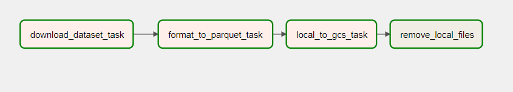
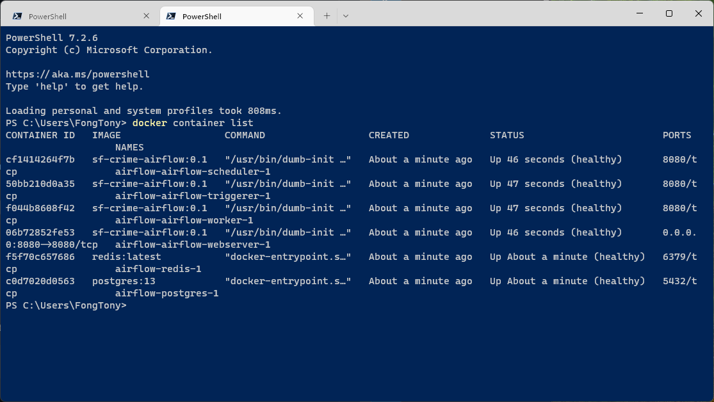

# Apache Airflow

This project runs Apache Airflow in a Docker container.

Airflow will retrieve the San Francisco incident data from the [San Francisco Police Department Incident Report dataset](https://data.sfgov.org/Public-Safety/Police-Department-Incident-Reports-2018-to-Present/wg3w-h783).

The Airflow Directed Acyclic Graph (DAG) retrieves the data from the San Francisco open data portal using the [Socrata Open Data API (SODA)](https://dev.socrata.com/).

The DAG "ingest_sf_crime_gcs" has 4 tasks:

* download_dataset_task extracts incident report data for a particular month using SODA and saves it temporarily as a .CSV file.

* format_to_parquet_task converts the .CSV file into a PARQUET file and saves it locally temporarily.

* local_to_gcs_task uploads the PARQUET file to the Google Cloud Storage (GCS) bucket organized by year and month.

* remove_local_files deletes the local temporary .CSV and .PARQUET files.

## Running Airflow

Before running Airflow in a Docker container, you must first do some initialization and [setup](./setup-docker.md).

After that's done, create the DAG file and save it to the dags folder.

### Run All Airflow Services in Docker

Use the following command to run Airflow in a Docker container:

    docker-compose up

When Docker has finished booting up all the services, open a web browser and log on to the Airflow web UI at:  `localhost:8080` with default username `airflow` and password `airflow`.

Navigate to the DAG and run it.

## Backfill Old Data

For this project, I decided to retreive the past 2 years worth of incident reports, so I had to run the Airflow backfill command.  To do this, follow these steps:

1. Open another command line window or terminal.

2. Execute the following command to get a list of running Airflow containers:

        docker container list

    

3. Make note of the "CONTAINER ID" of the airflow-worker container.  In the case above, the value you want is "`f044b8608f42`."

4. Run a Bash Command Inside Worker Container using the following command:

        docker exec -it f044b8608f42 /bin/bash

5. Execute Airflow Backfill Command:

        airflow dags backfill --start-date 2020-01-01 --end-date 2022-08-01 ingest_sf_crime_gcs

After this command executes, the Google Cloud Storage bucket should contain 2 years' worth of incident report data.

Go to the [SQL](../SQL/) folder to execute the SQL statement in BigQuery to load the dataset.
