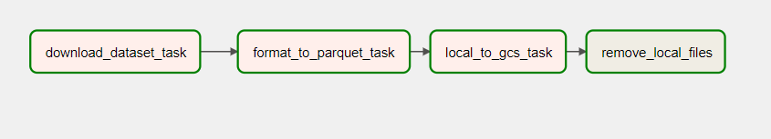
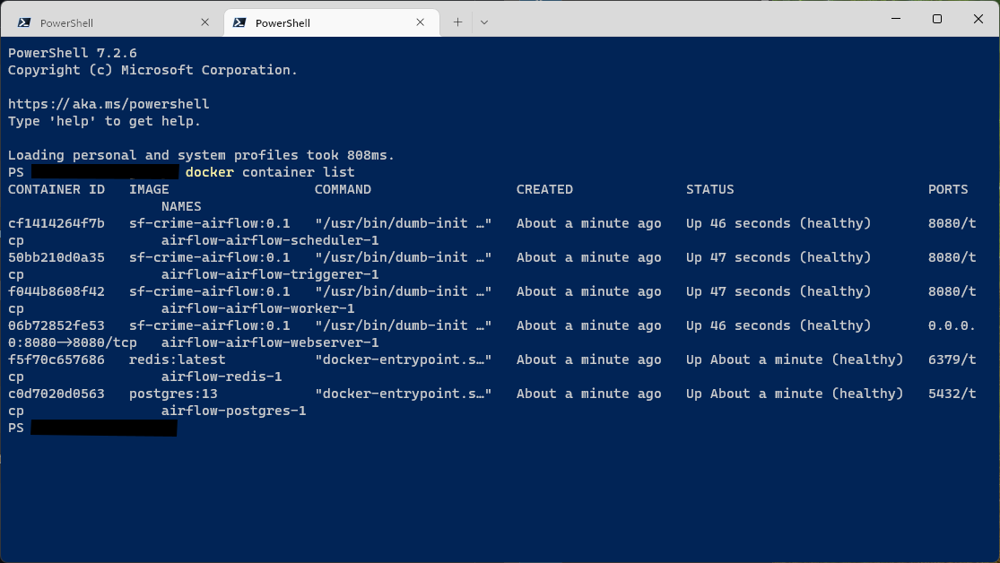

# Apache Airflow

This project runs Apache Airflow in a Docker container.

Airflow retrieves San Francisco incident data from the [San Francisco Police Department Incident Report dataset](https://data.sfgov.org/Public-Safety/Police-Department-Incident-Reports-2018-to-Present/wg3w-h783).

The Airflow Directed Acyclic Graph (DAG) retrieves data from the San Francisco open data portal using the [Socrata Open Data API (SODA)](https://dev.socrata.com/).

The DAG "ingest_sf_crime_gcs" has 4 tasks:



1. download_dataset_task
    * Extracts incident report data for a particular month using SODA API
    * Saves data to a CSV file

2. format_to_parquet_task
    * Converts the CSV file into a PARQUET file
    * Saves the file locally

3. local_to_gcs_task
    * Uploads the PARQUET file to the Google Cloud Storage (GCS) bucket (organized by year and month)

4. remove_local_files
    * deletes the local CSV and PARQUET files created in previous tasks.

To configure and run airflow, you will need to do the following:

1. Set Up Docker
2. Run All Airflow Services in Docker
3. Backfill Old Data

## Set Up Docker

Before running Airflow in a Docker container, you must first do some initialization and [setup](./setup-docker.md).

After that's done, create the DAG file and save it to the dags folder.

## Run All Airflow Services in Docker

Use the following command to run Airflow in a Docker container:

```sh
docker-compose up
```

When Docker has finished booting up all the services:

1. Launch a web browser
2. Log on to the Airflow web UI at:  `localhost:8080`
3. Enter username `airflow`
4. Enter password `airflow`
5. Navigate to the DAG
6. Run the DAG

## Backfill Old Data

For this project, I decided to retreive the past 2 years worth of incident reports, so I had to run the Airflow backfill command.  To do this, follow these steps:

1. Open another command line window or terminal.
2. Execute the following command to get a list of running Airflow containers:

    ```sh
    docker container list
    ```

    

3. Make note of the "CONTAINER ID" of the airflow-worker container.  In the case above, the value you want is "`f044b8608f42`."
4. Run a Bash Command Inside Worker Container using the following command:

    ```sh
    docker exec -it f044b8608f42 /bin/bash
    ```

5. Execute Airflow Backfill Command:

    ```sh
    airflow dags backfill --start-date 2020-01-01 --end-date 2022-08-01 ingest_sf_crime_gcs
    ```

After this command executes, the Google Cloud Storage bucket should contain 2 years' worth of incident report data.

Go to the [SQL](../SQL/) folder to execute the SQL statement in BigQuery to load the dataset.
