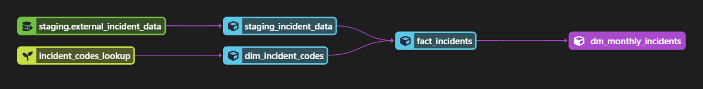

# dbt

## Environment
[Setup](./dbt-setup.md) the dbt environment.

## Data Pipeline

* staging.external_incident_data -- raw data loaded from the [SQL script](../SQL/load-parquet-to-staging.sql) that loads the data from extracted San Francisco incident report performed by [Airflow](../airflow/).

* incident_codes_lookup -- seed data from the [incident code](https://data.sfgov.org/Public-Safety/Reference-Police-Department-Incident-Code-Crosswal/ci9u-8awy) reference.

* staging_incident_data -- clean/wrangle the raw data to their correct data types and remove any duplicate rows.

* dim_incident_codes -- dimension table containing the incident codes, category, and subcategory.

* fact_incidents -- fact table containing the incident report data.

* dm_monthly_incidents -- summary table containing incident count by month and category.

## Build the dbt Project

The following commands are used to build the dbt project:

    dbt seed
    dbt run --var 'is_test_run: false'
    dbt test

The variable "is_test_run" is used for testing.  Running with default parameters only executes the first 100 rows as to save time and resources when testing.

### Resources:
- Learn more about dbt [in the docs](https://docs.getdbt.com/docs/introduction)
- Check out [Discourse](https://discourse.getdbt.com/) for commonly asked questions and answers
- Join the [dbt community](http://community.getbdt.com/) to learn from other analytics engineers
- Find [dbt events](https://events.getdbt.com) near you
- Check out [the blog](https://blog.getdbt.com/) for the latest news on dbt's development and best practices
