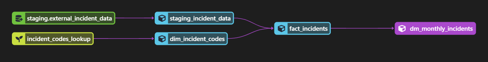

# dbt

Data Build Tool (dbt) is a tool that transforms data in data warehouses using SQL SELECT statements.

For this project, we will be using dbt to transform San Francisco crime incident data to a Star schema.

This guide covers the following topics:

* Environment
* Data Pipeline
* Build the dbt Project
* Resources

## Environment

[Setup](./dbt-setup.md) the dbt environment.

## Data Pipeline

The data pipeline for this project is composed of the following models:



* staging.external_incident_data
  * Raw data loaded from the [SQL script](../SQL/load-parquet-to-staging.sql) that loads the data from extracted San Francisco incident report performed by [Airflow](../airflow/)
* incident_codes_lookup
  * Seed data from the [incident code](https://data.sfgov.org/Public-Safety/Reference-Police-Department-Incident-Code-Crosswal/ci9u-8awy) reference
* staging_incident_data
  * Clean/wrangle the raw data to their correct data types and remove any duplicate rows
* dim_incident_codes
  * Dimension table containing the incident codes, category, and subcategory.
* fact_incidents
  * Fact table containing the incident report data

    Note: the fact_incidents table is partitioned by the month of the incident date

    ```jinja
        {{ config(
            materialized='table',
            partition_by={
                "field": "incident_datetime",
                "data_type": "datetime",
                "granularity": "month"
            }
        ) }}
    ```

* dm_monthly_incidents
  * Summary table containing incident count by month and category

## Build the dbt Project

Execute the following commands to build and run the dbt project:

```sh
dbt seed
dbt run --var 'is_test_run: false'
dbt test
```

The variable "is_test_run" is used for testing.  Running with default parameters only executes the first 100 rows as to save time and resources when testing.

### Resources

If you would like to know more about the dbt tool:

* Learn more about dbt [in the docs](https://docs.getdbt.com/docs/introduction)
* Check out [Discourse](https://discourse.getdbt.com/) for commonly asked questions and answers
* Join the [dbt community](http://community.getbdt.com/) to learn from other analytics engineers
* Find [dbt events](https://events.getdbt.com) near you
* Check out [the blog](https://blog.getdbt.com/) for the latest news on dbt's development and best practices
