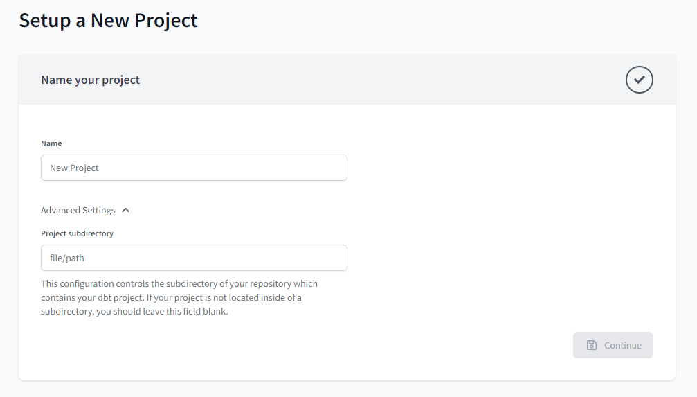
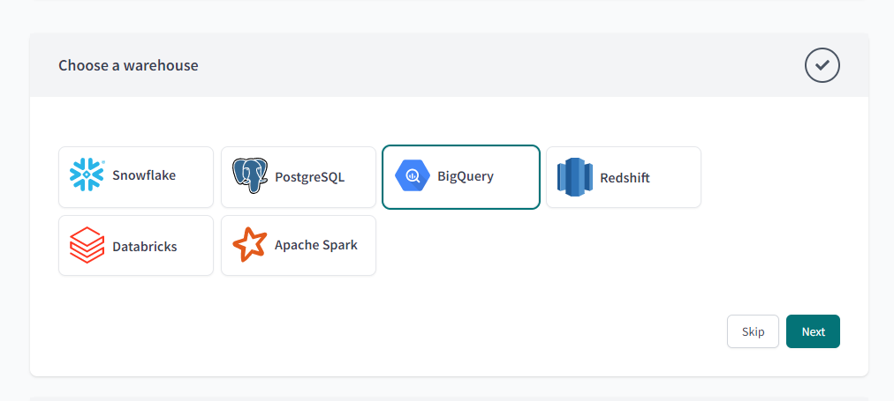
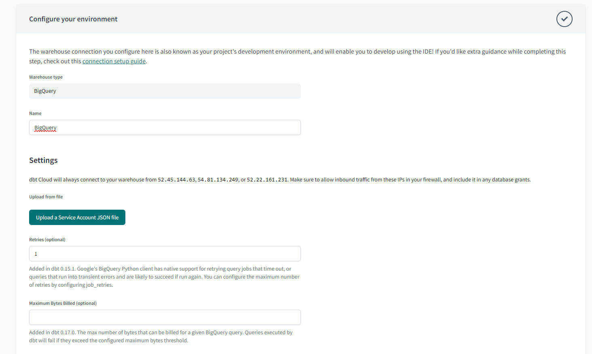
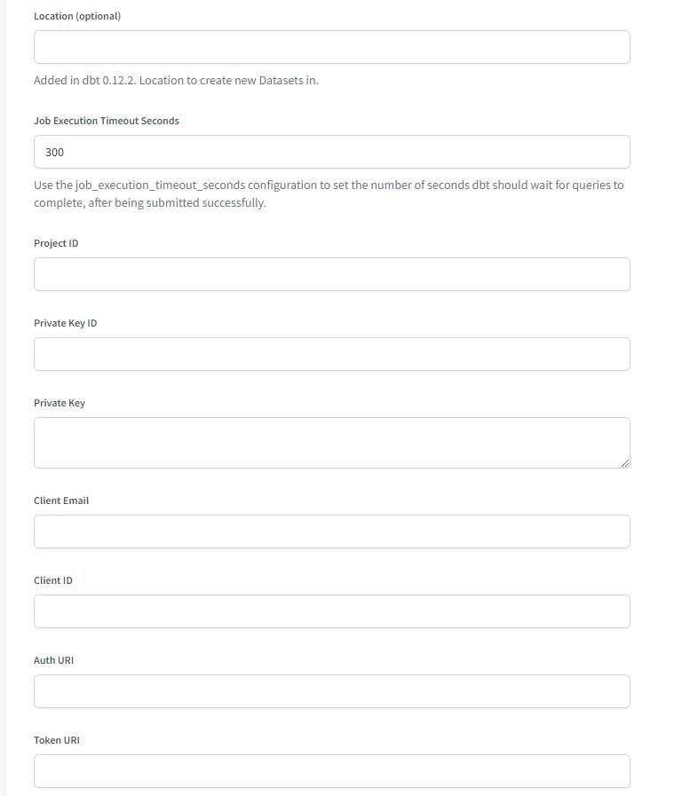
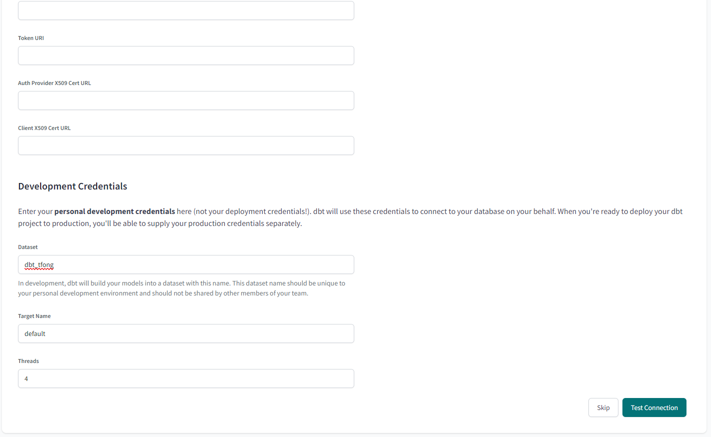
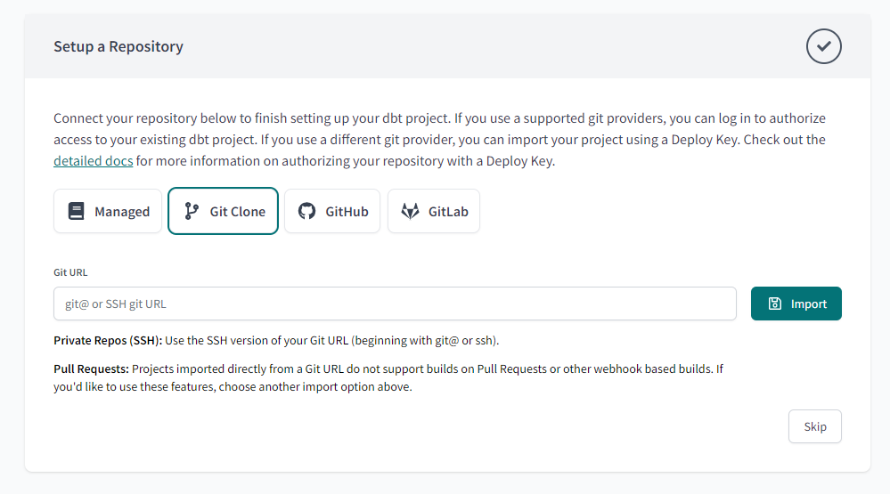
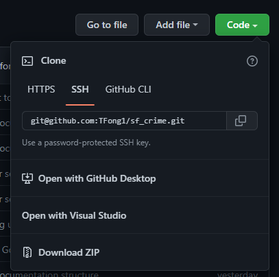
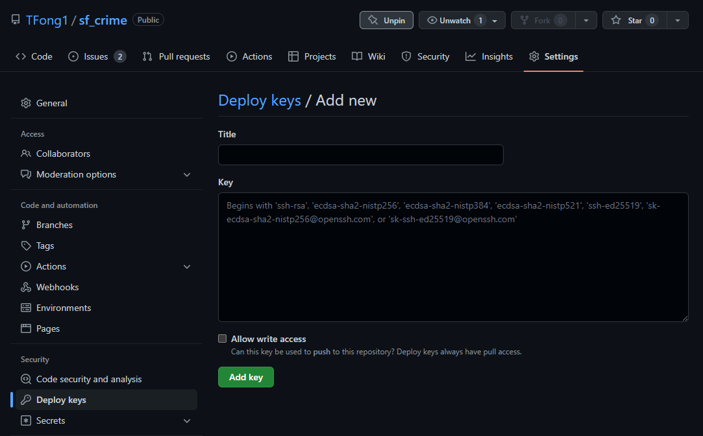

# How to Set Up dbt Environment

Data Build Tool (dbt) is a tool that transforms data in data warehouses by writing SQL SELECT statements.

For this project, we will be using dbt to transform San Francisco crime incident data that has been loaded into our data warehouse (staging area) to a simple Star schema.  More information about dbt can be found [here](https://docs.getdbt.com/docs/introduction).

## Create a dbt Cloud Project

Create a dbt cloud account at [https://getdbt.com/signup](https://getdbt.com/signup).  Connect to the Google cloud environment [using these instructions](https://docs.getdbt.com/docs/dbt-cloud/cloud-configuring-dbt-cloud/cloud-setting-up-bigquery-oauth).

Refer back to [Create Service Account for dbt](../gcp/README.md) for instructions on how to create a Google Cloud Platform authentication key for dbt.

Once you have created an account and logged in, you will be prompted to create a new project.

### Requirements for dbt Project

* Access to data warehouse (JSON authentication key)
* Read/Write access to GitHub repository, where the dbt project files will be stored and version controlled.

### Set up New Project

#### Name the project

Under Name, choose a name for the dbt project.

*Optional:* Project subdirectory is the folder where dbt will store the necessary dbt files in my GitHub repository.  In my case, I entered "dbt", which put the the dbt files in the dbt subfolder in this GitHub repository.

Click "Continue" to go to the next section.

#### Choose a Warehouse

Choose BigQuery as the type of data warehouse dbt should connect to.

Click "Next."

#### Configure Your Environment

Enter a name for the connection.

Click on "Upload a Service Account JSON file."  This file is the JSON file created when the BigQuery dbt service account was created [here](../gcp/README.md).  Uploading the JSON file will fill in the appropriate fields below this setting.

Under "location (optional)" you can enter the location of the BigQuery region.  This can be found under the "Data location" in the project or dataset properties.

Under "Development Credentials", the dataset name will be the name of the dataset in BigQuery under the Project ID.

Press "Test Connection" to test the connection and move on to the next section.

#### Set up a Repository

Select "Git Clone."  Select the GitHub SSH URL in the GitHub repository.  Click "Import."

#### *Optional* Set up a Deployment Key

In the dbt project screen (or go to Account Settings -> Projects -> click on the project name) and click on the GitHub repository link.

Copy the contents of the "Deploy Key" text box.

Go to the GitHub repository Settings page and scroll down to Security and click on "Deploy Keys."

Click on the "Add deploy key" button and paste the value you just copied in dbt.  **Make sure the "Allow write access" checkbox is checked.** Click on "Add key."

