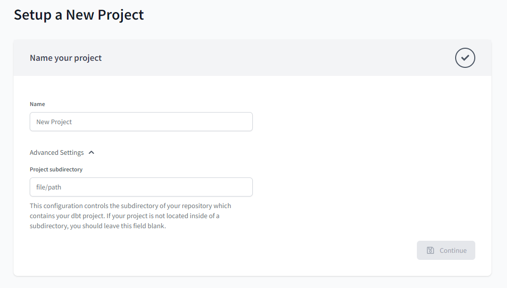
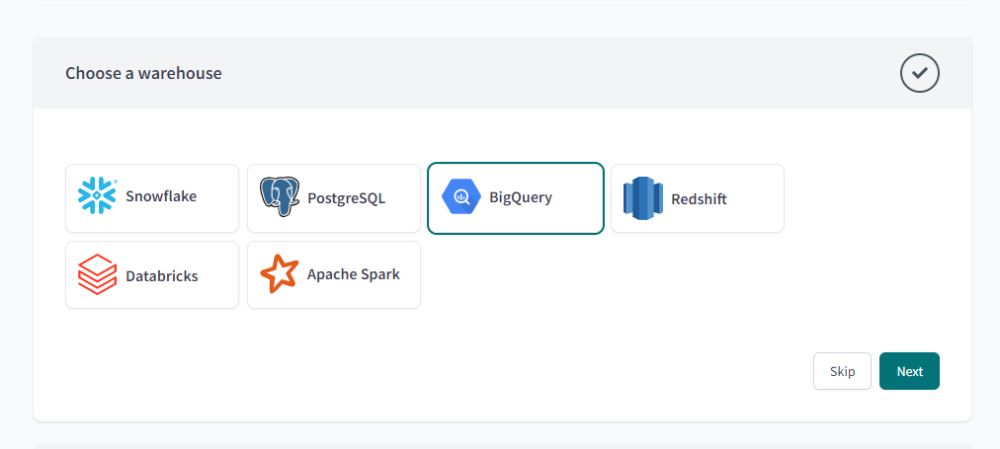
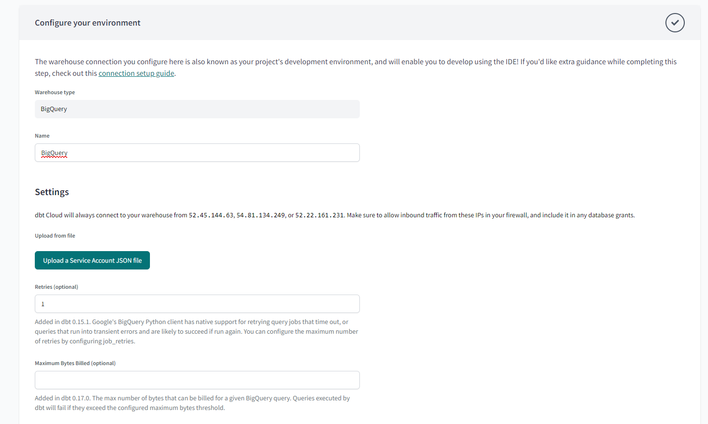
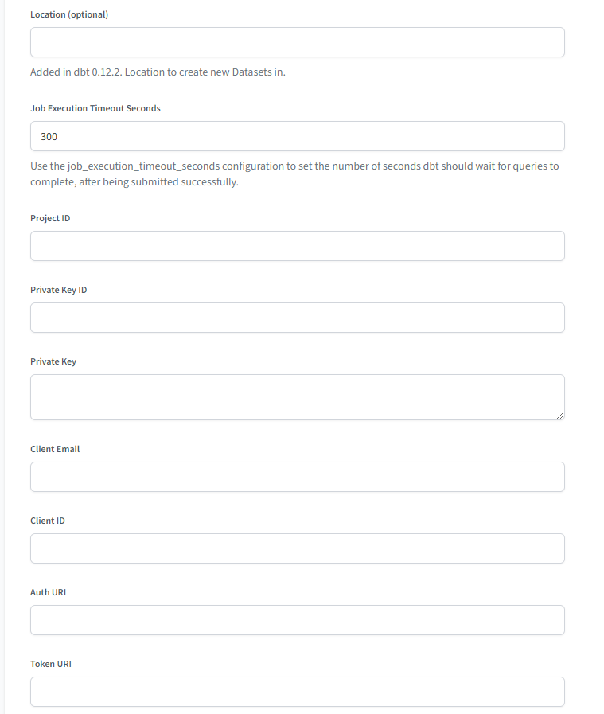
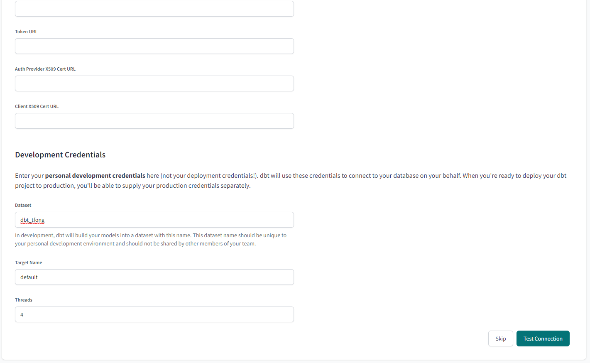
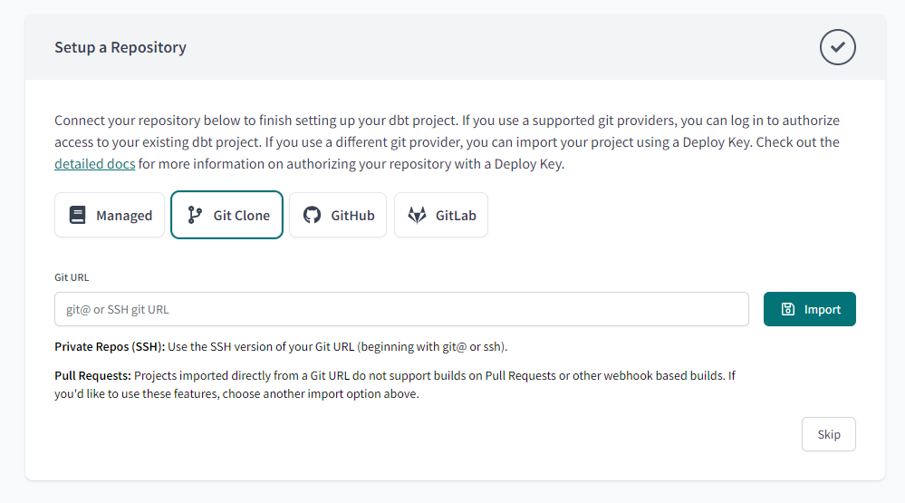
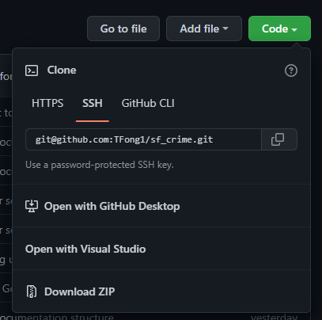
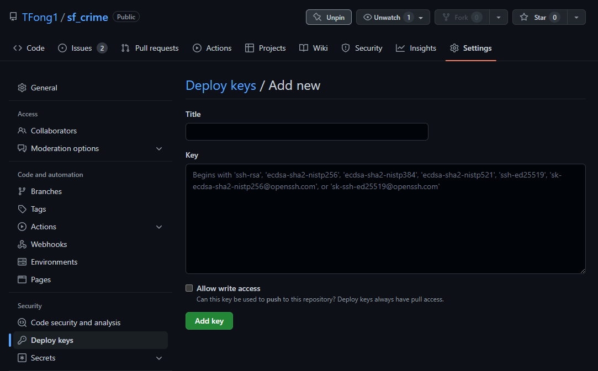
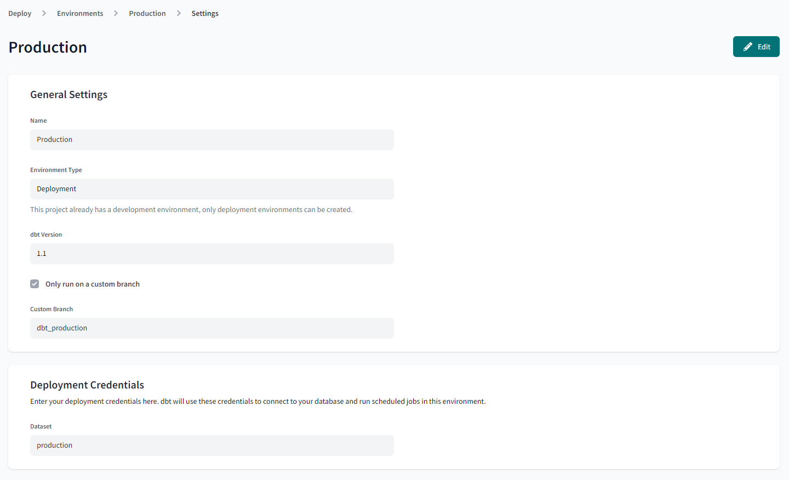

# How to Set Up dbt Environment

This is a guide to setting up and configuring the dbt environment. This project uses the dbt cloud, but the local version of dbt can be used as well.

The following are covered in this document:

1. Create a dbt Cloud Account
2. Requirements for dbt Project
3. Set Up a New Project

## Create a dbt Cloud Account

Create a dbt cloud account:

1. Create a dbt cloud account
    * Sign up at [https://getdbt.com/signup](https://getdbt.com/signup) if you do not have a dbt cloud account
2. Connect to the Google Cloud environment
    * Follow [these instructions](https://docs.getdbt.com/docs/dbt-cloud/cloud-configuring-dbt-cloud/cloud-setting-up-bigquery-oauth) to connect your Google cloud environment with dbt
    * Refer to [Create Service Account for dbt](../gcp/README.md#create-service-account-for-dbt) for creating a Google Cloud Platform authentication key
3. Log in to dbt cloud

## Requirements for dbt Project

The following are required for the dbt project:

* Access to data warehouse (JSON authentication key)
* Read/Write access to GitHub repository, where the dbt project files will be stored and version controlled.

## Set Up a New Project

Create a new dbt cloud project and configure the project as follows:

### Name the project

1. Under Name, choose a name for the dbt project
    * *Optional:* Project subdirectory is the folder where dbt will store the necessary dbt files in my GitHub repository.  In my case, I entered "dbt", which put the the dbt files in the dbt subfolder in this GitHub repository.
2. Click "Continue" to go to the next section

### Choose a Warehouse

1. Choose BigQuery as the type of data warehouse dbt should connect to
2. Click "Next"

### Configure Your Environment

1. Enter a name for the connection
2. Click on "Upload a Service Account JSON file."
    * This is the JSON file created when the BigQuery dbt service account was [created](../gcp/README.md#create-service-account-for-dbt)
    * Uploading the JSON file will fill in the appropriate fields below this setting
3. Under "location (optional)" you can enter the location of the BigQuery region
    * This can be found under the "Data location" in the project or dataset properties.
4. Under "Development Credentials", the dataset name is the name of the dataset in BigQuery under the Project ID
5. Press "Test Connection"
    * Tests the connection
6. Move on to the next section

### Set up a Repository

1. Select "Git Clone"
2. Select the GitHub SSH URL in the GitHub repository
3. Click "Import"

### Set up a Deployment Key

1. In the dbt project screen (or go to Account Settings -> Projects -> click on the project name) and click on the GitHub repository link
2. Copy the contents of the "Deploy Key" text box
3. Go to the GitHub repository Settings page
4. Scroll down to Security and click on "Deploy Keys"
5. Click on the "Add deploy key" button
6. Paste the value you just copied in dbt
    * **Make sure the "Allow write access" checkbox is checked.**
7. Click on "Add key"

### *Optional* Create a dbt Production Environment

1. Log on to dbt Cloud
2. Click on the dbt project
3. Navigate to the Environments section
4. Click on Create Environment button
5. Enter the following information:
    
6. In the GitHub repository, add the dbt production branch
    * When dbt runs build, it wants to clone a repository
    * Add a branch protection rule for the main branch and the dbt build will fail unless I create a branch (when the "only run on a custom branch" is checked)
    * Create a branch called "dbt_production" to match the dbt project settings

Go back to [dbt Data Pipeline](./README.md#data-pipeline).
