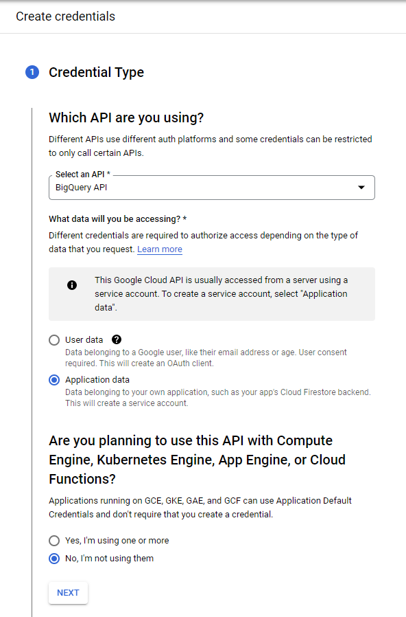
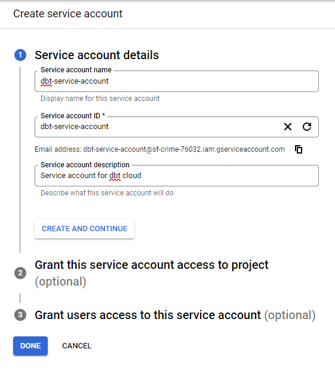
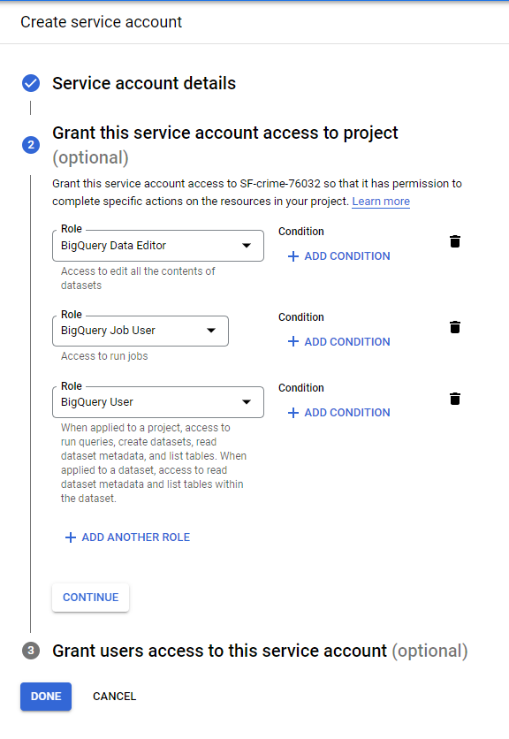
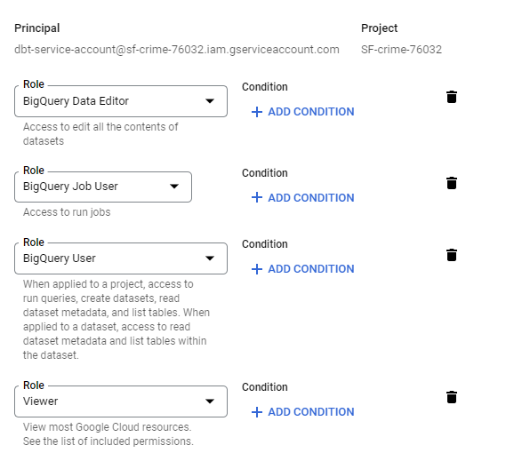
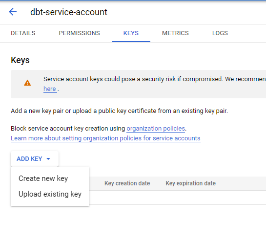
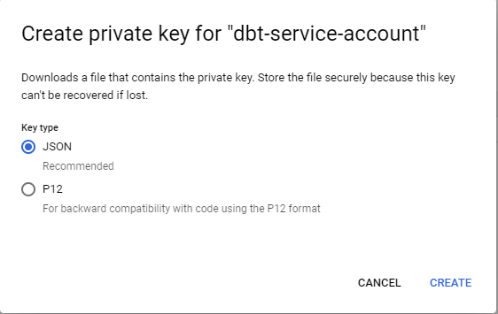

# How to Set Up Google Cloud Platform Environment

## Introduction

Google Cloud Platform (GCP) is used to house our data lake and data warehouse for this project.
The Airflow DAG will upload parquet files to the Google Cloud Storage (GCS) bucket.  Let's set up our Google Cloud environment for this project.

## Logon / Create Google Cloud Account

Go to [https://console.cloud.google.com](https://console.cloud.google.com).

Create a new Google account to be used for Google Cloud Platform or log on to an existing Google account to be used for GCP.

## Create a Project

Go to the [Cloud Resource Manager page](https://console.cloud.google.com/cloud-resource-manager).

Click on "CREATE PROJECT".  Enter a project name (note the Project ID as you will need this information later to configure Terraform), enter the required information and click the create button.

## Create Service Account for dbt

Click on the "Create Principal" button/link and follow the screens below:

I forgot to include the "Viewer" role for this service account, so be sure to add it before creating the account.

## Download the Service Account Keys (.JSON) for Authentication

Click on the service account and navigate to the Keys tab/page.  Click on "Create new key."

Be sure "JSON" is selected and click on Create.

Download the .json keys in a folder.  This JSON file will be used to set up dbt later.

## Create Service Account for the ELT/Airflow Process

Create another principal service account similar to the dbt account above.  Name the principal accordingly and assign the following roles:

* BigQuery Admin
* Storage Admin
* Storage Object Admin
* Viewer

Also create and download a JSON authentication key to be used with Airflow.

Be sure to reference the JSON file in the /airflow/.env file under GOOGLE_APPLICATION_CREDENTIALS and the variable "credentials" in the /terraform/variables.tf file.

## Enable API for the Google Cloud Project

* https://console.cloud.google.com/apis/library/iam.googleapis.com
* https://console.cloud.google.com/apis/library/iamcredentials.googleapis.com

Go to the links above and click on the "Enable" button to enable these two APIs.

## Install Google Cloud SDK

Go to [Google Cloud SDK](https://cloud.google.com/sdk/docs/quickstart) and install the SDK to be used when setting up Terraform.
