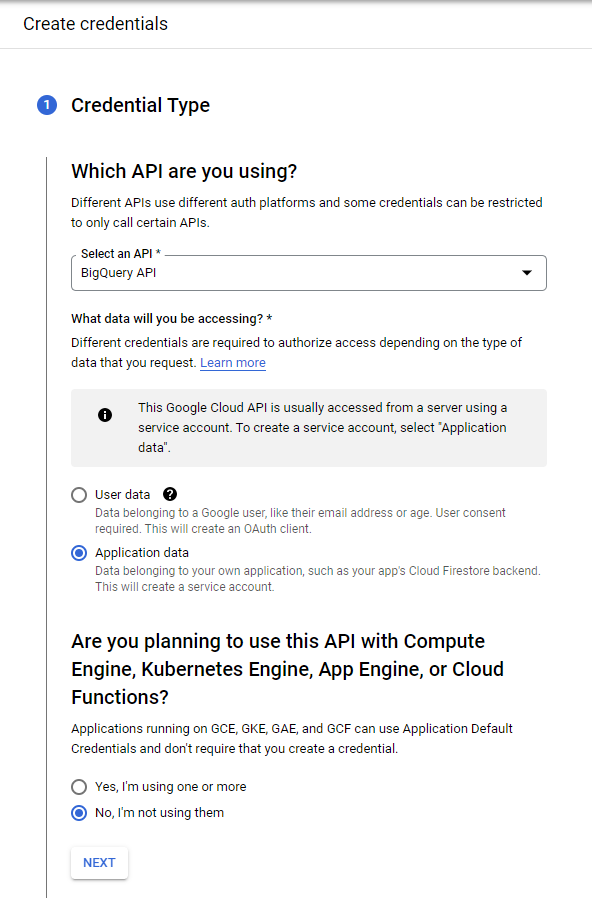
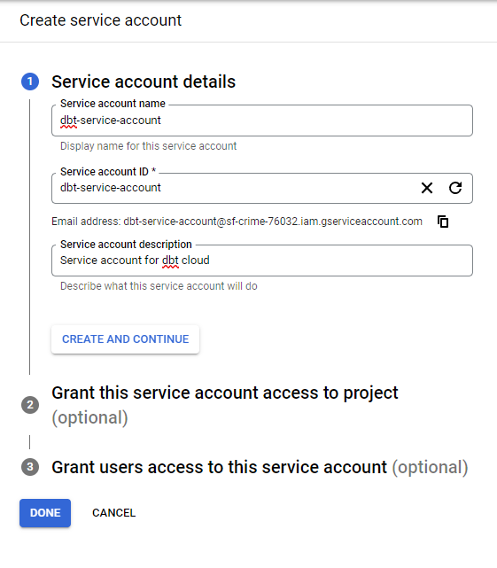
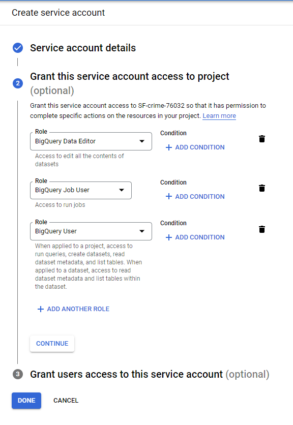
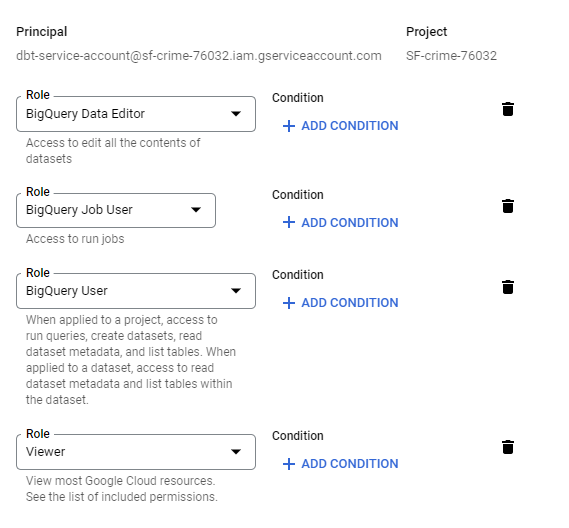
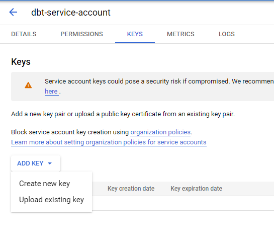
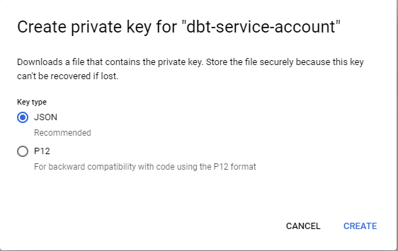

# How to Set Up Google Cloud Platform Environment

## Introduction

Google Cloud Platform (GCP) is used to house our data lake and data warehouse for this project.
The Airflow Directed Acyclic Graph (DAG) will upload parquet files to the Google Cloud Storage (GCS) bucket.  Let's set up our Google Cloud environment.

## Logon / Create Google Cloud Account

1. Go to [https://console.cloud.google.com](https://console.cloud.google.com)
2. Create a new Google Cloud account or log in to an existing account

## Create a Project

1. Go to the [Cloud Resource Manager page](https://console.cloud.google.com/cloud-resource-manager)
2. Click on "CREATE PROJECT"
3. Enter a project name
    * (note the Project ID as you will need this to configure Terraform)
4. Enter the required information
5. Click the "Create"

## Create Service Account for dbt

1. Click on the "Create Principal" button/link or [BigQuery credential wizard](https://console.cloud.google.com/apis/credentials/wizard)
2. Follow the screens below:

    * Add the "Viewer" role by clicking + ADD ANOTHER ROLE.

Note: If you get an error when you run a dbt job, try to add the BigQuery Admin role to the dbt service account.  This probably should be temporary as you need admin rights to create a new dataset/table.

## Download the Service Account Keys (.JSON) for Authentication

Now that the service account has been created, we need to add and download a JSON key.

1. Select the Keys tab
2. Click on "ADD KEY"
3. Select "Create New Key"

4. Select key type "JSON"
5. Be sure "JSON" is selected and click on Create

6. Download the .json keys to any folder.  This JSON file will be used to set up dbt later.

## Create Service Account for the ELT/Airflow Process

1. Create another principal service account similar to the dbt account above
2. Name the principal accordingly and assign the following roles:

    * BigQuery Admin
    * Storage Admin
    * Storage Object Admin
    * Viewer

3. Create and download a JSON authentication key to be used with Airflow.
4. Reference the JSON file in the /airflow/.env file under GOOGLE_APPLICATION_CREDENTIALS
5. Reference the variable "credentials" in the /terraform/variables.tf file.

## Enable API for the Google Cloud Project

1. Click the links below:

    * [https://console.cloud.google.com/apis/library/iam.googleapis.com](https://console.cloud.google.com/apis/library/iam.googleapis.com)
    * [https://console.cloud.google.com/apis/library/iamcredentials.googleapis.com](https://console.cloud.google.com/apis/library/iamcredentials.googleapis.com)

2. Click on the "Enable" button to enable these two APIs

## Install Google Cloud SDK

Go to [Google Cloud SDK](https://cloud.google.com/sdk/docs/quickstart) and install the SDK to be used when setting up Terraform.

## Next Steps

Now that the GCP has been set up, now provision these cloud resources using [Terraform](../terraform/).
