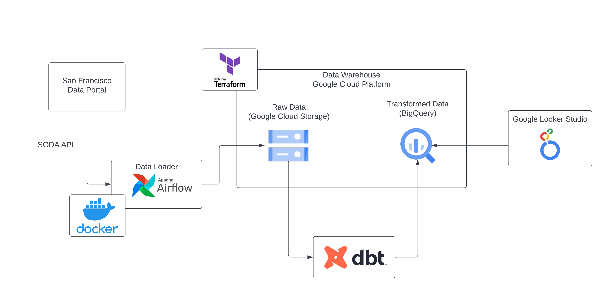

# San Francisco Crime Data Engineering Capstone Project

This document provides an overview of the project construction and steps to recreate it.

## Project Architecture

Below is a pictoral description of the architecture used in this project.

The workflow is as the following:

1. Extract Data
    * Airflow extracts data from the San Francisco data portal using the Socrata Open Data API
    * Airflow runs in a Docker container
    * Airflow generates parquet files
2. Upload to Data Lake
    * Upload parquet files to the data lake
    * Google Cloud environment is created by Terraform
3. Move to Data Warehouse
    * Data is moved from the lake to warehouse via SQL statement executed in GCP
4. Transform Data
    * dbt transforms the data in the warehouse for use by Google Looker Studio

## Steps to Create Project

This document outlines the steps to recreate this project.

1. [Set Up Google Cloud Platform Project](./gcp/)
2. [Create Infrastructure Using Terraform](./terraform/)
3. [Set Up Data Pipeline Using Airflow](./airflow/)
4. [Load Data Lake Files to Staging Area](./SQL/)
5. [Transform Data Using dbt](./dbt/)

## Components

Below are some of the links to the components used to create this project.

* [Google Cloud Platform](https://cloud.google.com)
* [Terraform](https://www.terraform.io)
* [Apache Airflow](https://airflow.apache.org)
* [dbt](https://getdbt.com)
* [Socrata Open Data Application Programming Interface (SODA)](https://dev.socrata.com/)
* [Google Looker Studio (Formally Google Data Studio)](https://lookerstudio.google.com)
